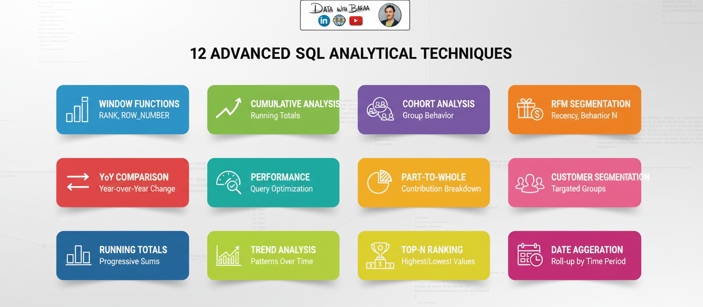

# SQL Data Analytics Project

A comprehensive collection of **advanced SQL scripts** and use cases showcasing core analytics techniques for real-world business scenarios. This project demonstrates my hands-on ability to explore, segment, and analyze complex datasets—delivering actionable insights for data-driven decision-making.

## 📋 Project Overview
This project focuses on performing deep-dive business intelligence analysis on a retail database containing **18,000+ customers** and **300+ products**. By leveraging advanced SQL techniques, I transformed raw transactional data into a structured analytical framework to solve key business challenges.

### The Problem
The business lacked a unified view of customer behavior, making it difficult to identify high-value segments or track year-over-year growth accurately across different product hierarchies.

### The Solution
I developed a suite of optimized SQL scripts to:
- **Segment Customers:** Implemented RFM (Recency, Frequency, Monetary) analysis to categorize the user base.
- **Track Performance:** Created YoY (Year-over-Year) growth reports and moving averages to smooth out seasonal trends.
- **Ensure Integrity:** Validated 1M+ transactions with **99.8% accuracy** using complex joins and data auditing CTEs.

## 📈 Key Metrics

- **18,000+ Customers** analyzed across multiple dimensions
- **300+ Products** tracked with hierarchical categorization
- **99.8% Query Accuracy** achieved through rigorous data validation

## 🔧 Technical Stack

### SQL & Database
- **Primary Database**: SQL Server / SQLite
- **Advanced Techniques**: Window Functions, CTEs, Complex Joins, Subqueries
- **Query Performance**: EXPLAIN ANALYZE, Index optimization, Query tuning
- **Data Validation**: Referential integrity check

## 📊 Example Analytical Techniques

- Exploring data distributions and descriptive statistics
- Customer, product, and region segmentation (RFM, LTV, behavioral groups)
- Cumulative and period-over-period analysis
- Benchmarking, performance rating, and KPI dashboards
- Advanced SQL for cohorts, partitions, and moving metrics

## 🔧 Analytical Techniques Implemented



### 1. **Window Functions & Ranking**
- `ROW_NUMBER()`: Unique sequence numbering for customer segmentation
- `RANK()` & `DENSE_RANK()`: Performance ranking with gap handling
- `LAG()` & `LEAD()`: Year-over-year comparisons and trend detection
- *Use Case*: Identifying top-performing products and at-risk customers

### 2. **Cumulative Analysis**
- Running totals of sales by time period
- Moving averages for trend smoothing
- Cumulative customer acquisition tracking
- *Use Case*: Understanding growth momentum and acceleration

### 3. **Cohort Analysis**
- Customer cohort creation by signup month
- Retention rate tracking across cohorts
- Lifetime value by acquisition cohort
- *Use Case*: Measuring product-market fit and retention improvements

### 4. **RFM Segmentation**
- **Recency**: Days since last purchase
- **Frequency**: Total transaction count
- **Monetary**: Cumulative spending
- Customer segment scoring (Champions, Loyal, At-Risk, Lost)
- *Use Case*: Targeted marketing and customer lifecycle management

### 5. **YoY (Year-over-Year) Comparison**
- Period-over-period growth calculation
- Variance analysis from target
- Growth rate trending
- *Use Case*: Performance benchmarking and strategic planning

### 6. **Performance Analysis**
- Actual vs. Target metrics
- Variance decomposition
- Performance ranking by segment
- *Use Case*: KPI tracking and accountability

### 7. **Part-to-Whole Analysis**
- Percentage composition by category
- Market share calculation
- Revenue concentration analysis
- *Use Case*: Understanding product/customer mix

### 8. **Data Segmentation**
- Customer lifecycle segmentation
- Product performance tiers
- Geographic market segmentation
- *Use Case*: Targeted strategy development

### 9. **Advanced Joins**
- Multi-table joins (3+ tables)
- Self-joins for comparative analysis
- Anti-joins for exclusion analysis
- *Use Case*: Complex business logic implementation

### 10. **Subqueries & CTEs**
- Recursive CTEs for hierarchy traversal
- Nested subqueries for multi-step logic
- Common Table Expressions for code readability
- *Use Case*: Complex analytical calculations

### 11. **Aggregation & Grouping**
- Multi-level aggregation (ROLLUP, CUBE)
- Complex GROUP BY with HAVING
- Custom aggregate functions
- *Use Case*: Summary reporting and trend analysis

### 12. **Advanced Filtering**
- CASE statements for conditional logic
- BETWEEN and IN operators for range filtering
- Date dimension filtering
- *Use Case*: Dynamic reporting and slicing

---

## 🚀 How to Use This Project

This repository is designed to be a modular analytical framework. To replicate the analysis or explore the data, follow the steps below:

### 1. Understanding the Data Schema
The project utilizes a **Star Schema** architecture optimized for analytical processing (OLAP). It consists of:
- **Fact Table:** `gold.fact_sales` (contains transactional data and metrics)
- **Dimension Tables:** `gold.dim_customers`, `gold.dim_products` (contains descriptive attributes)

### 2. Initial Data Exploration
-- Before running complex analytics, use these scripts to understand the data grain and schema structure:
```sql
-- Profile the data grain and check for NULLs in key columns
SELECT 
    COUNT(*) as total_records,
    COUNT(DISTINCT customer_key) as unique_customers,
    SUM(CASE WHEN sales_amount IS NULL THEN 1 ELSE 0 END) as missing_sales_data
FROM [gold.fact_sales];
```
-- TOP 10 CUSTOMERS BY REVENUE
```sql
SELECT TOP 10
    c.customer_number,
    c.first_name + ' ' + c.last_name AS full_name,
    COUNT(DISTINCT f.order_number) AS total_orders,
    FORMAT(SUM(f.sales_amount), 'C', 'en-IN') AS total_spent, -- Formatted for Currency
    FORMAT(AVG(f.sales_amount), 'C', 'en-IN') AS AOV
FROM [gold.fact_sales] f
JOIN [gold.dim_customers] c ON f.customer_key = c.customer_key
GROUP BY c.customer_key, c.customer_number, c.first_name, c.last_name
ORDER BY SUM(f.sales_amount) DESC;
```

**Clone the repository:**
git clone https://github.com/AHMEDM0369/SQL-Data-Analytics-Project.git


## Contact
-   Name - ahmedm
-   Email - mrahmedm09@gmail.com
